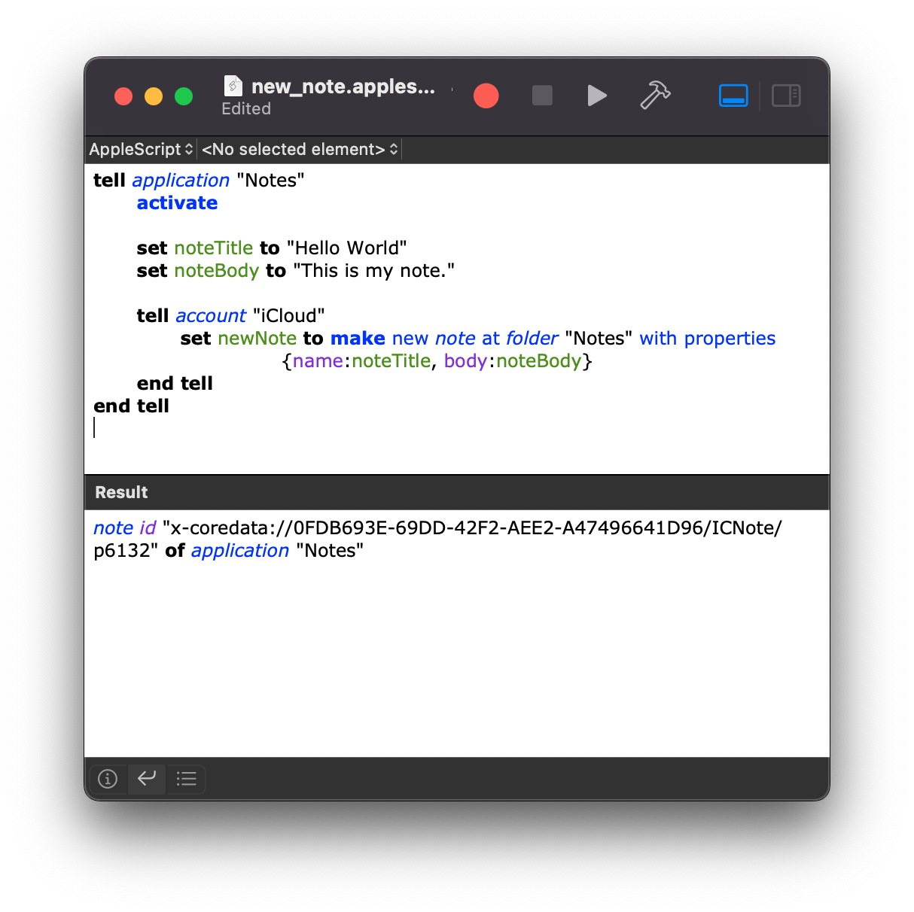
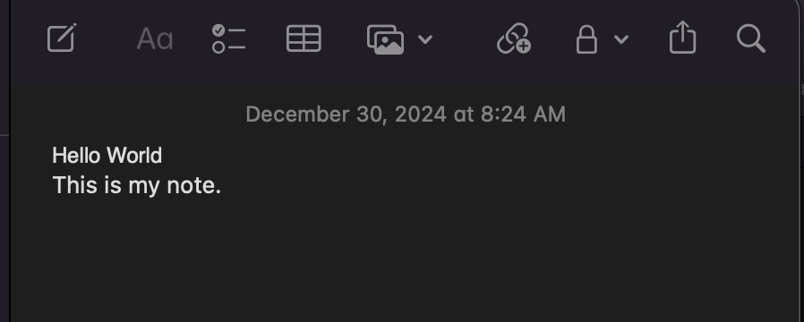
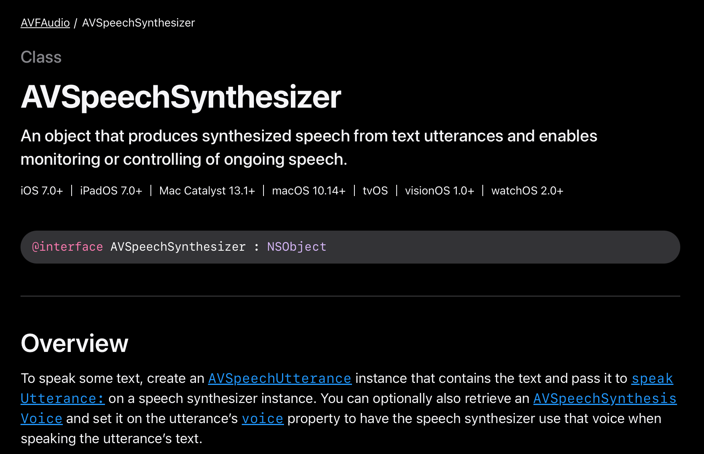
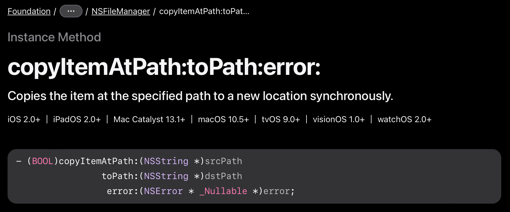
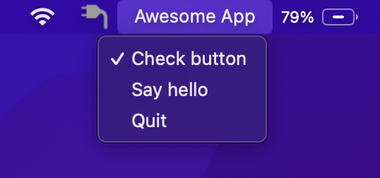
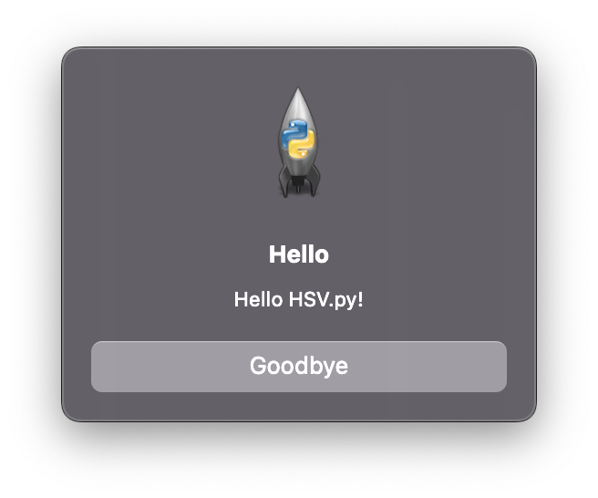
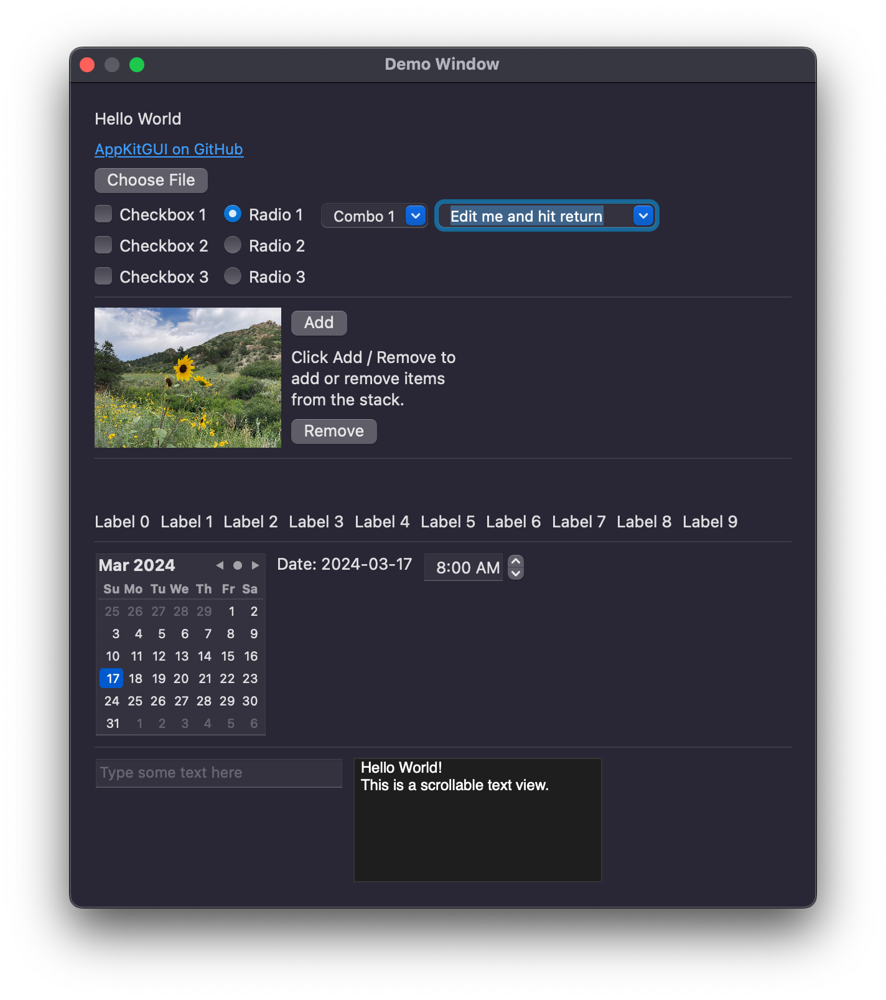

<!--
_backgroundColor: black
_color: white
-->

<!-- class: invert -->

# Biting the Apple

## Unlocking macOS with Python


---

<!--
paginate: true
footer: "Biting the Apple: Unlocking macOS with Python"
-->

# About Me


- Hobbyist programmer
- First code in Tandy BASIC on a TRS-80 Model III
- Reformed Perl hacker
- Pythonista since 2018
- [github.com/RhetTbull](https://github.com/RhetTbull)

---

# Installing Python on macOS

- [Homebrew](https://brew.sh): [Homebrew Python is Not For You](https://justinmayer.com/posts/homebrew-python-is-not-for-you/)

- [Conda](https://docs.conda.io/projects/conda/en/latest/index.html)

- [Python.org](https://www.python.org/downloads/)

- [uv](https://docs.astral.sh/uv/): `uv python install 3.13`

## <span style="text-align: center; display: block;">Just use uv or python.org</span>

---

# Automating Mac Apps




Many Mac apps are scriptable using [AppleScript](https://developer.apple.com/library/archive/documentation/AppleScript/Conceptual/AppleScriptLangGuide/conceptual/ASLR_fundamentals.html)

```applescript
tell application "Notes"
	activate

	set noteTitle to "Hello World"
	set noteBody to "This is my note."

	tell account "iCloud"
		set newNote to make new note at folder "Notes" with properties
		          {name:noteTitle, body:noteBody}
	end tell
end tell
```

---

# Isn't This Talk Supposed To Be About Python?

`pip install py-applescript`

```python
import applescript

def create_note(title: str, body: str) -> str:
    """Create a new note in Notes.app"""
    script = """
    on createNote(noteTitle, noteBody)
        tell application "Notes"
            activate

            tell account "iCloud"
                set newNote to make new note at folder "Notes" with properties {name:noteTitle, body:noteBody}
                return id of newNote
            end tell
        end tell
    end createNote
    """
    ascript = applescript.AppleScript(script)
    return str(ascript.call("createNote", title, body))

note_id = create_note("Hello World", "This is my note.")
print(f"New note created with id {note_id}")
```

---

# There's a Package For That!

`pip install macnotesapp`

```python
import macnotesapp

new_note = macnotesapp.NotesApp().make_note("Hello World", "This is my note.")
print(f"New note created with ID {new_note}")
```

`pip install photoscript`

```python
import photoscript

for photo in photoscript.PhotosLibrary().selection:
    photo.keywords += ["Travel"]
```
---

# PyXA: Python for Automation

`pip install mac-pyxa` (Doesn't work yet with Python 3.13)

<!-- Supports most Apple Mac apps and some 3rd party apps. -->

```python
from datetime import datetime
import PyXA

def create_reminder(name, due_date=None):
    """Creates a new reminder in the Mac Reminders app's default list."""
    try:
        reminders_app = PyXA.Application("Reminders")
        due_date = datetime.fromisoformat(due_date) if due_date else None
        reminder = reminders_app.new_reminder(name=name, due_date=due_date)
        print(f"Reminder '{name}' created successfully.")
    except Exception as e:
        print(f"Failed to create reminder: {e}")

create_reminder("Finish HSV.py talk", due_date="2025-02-01T17:00:00")
```

---

# Beyond Scripting: Accessing the Power of Native APIs



Apple provides useful APIs in Objective-C and Swift that enable features like extracting text from images, speech synthesis, accessing the Mac's camera, etc.

Can we use these from Python?

---

# Yes! Python to Objective-C Bridge

## [PyObjC](https://pyobjc.readthedocs.io/en/latest/)

Appears to have at least tacit blessing from Apple. Stable, offers support for most macOS APIs. Does not support iOS.

## [Rubicon](https://rubicon-objc.readthedocs.io/en/stable/)

Part of the [BeeWare](https://beeware.org) project. Supported by [Anaconda](https://www.anaconda.com). Supports both macOS and iOS.

---

<!-- _class: "invert small-text" -->
# Simple PyObjC Example



Use native [copy-on-write for APFS](https://eclecticlight.co/2020/04/14/copy-move-and-clone-files-in-apfs-a-primer/) file systems.

- Python's native [file copy functions](https://docs.python.org/3/library/shutil.html) cannot take advantage of copy-on-write; also do not copy all metadata.
- Apple's [NSFileManager](https://developer.apple.com/documentation/foundation/nsfilemanager) provides [copyItemAtPath:toPath:error:](https://developer.apple.com/documentation/foundation/nsfilemanager/1407903-copyitematpath) method that does use copy-on-write

Python implementation:

```python
import Foundation

def copyfile(src: str, dest: str):
    """Copy file from src to dest using NSFileManager"""
    filemgr = Foundation.NSFileManager.defaultManager()
    success, error = filemgr.copyItemAtPath_toPath_error_(src, dest, None)
    if not success:
        raise OSError(error)
```

---
<!-- _class: "invert small-text" -->
# Speech Synthesis Example

```python
import AVFoundation
from Foundation import NSObject
from PyObjCTools.AppHelper import runEventLoop, stopEventLoop

class SpeechSynthesizerDelegate(NSObject):
    def speechSynthesizer_didFinishSpeechUtterance_(self, synthesizer, utterance):
        stopEventLoop()

def speak_string(text: str) -> None:
    synthesizer = AVFoundation.AVSpeechSynthesizer.alloc().init()
    utterance = AVFoundation.AVSpeechUtterance.speechUtteranceWithString_(text)
    voice = AVFoundation.AVSpeechSynthesisVoice.voiceWithLanguage_("en-US")
    utterance.setVoice_(voice)
    delegate = SpeechSynthesizerDelegate.alloc().init()
    synthesizer.setDelegate_(delegate)
    synthesizer.speakUtterance_(utterance)
    runEventLoop()
```

---
<!-- _class: "invert small-text" -->
# Status Bar Apps




[Rumps: Ridiculously Uncomplicated macOS Python Statusbar](https://github.com/jaredks/rumps)

```python
import rumps

class AwesomeStatusBarApp(rumps.App):
    @rumps.clicked("Check button")
    def onoff(self, sender):
        sender.state = not sender.state

    @rumps.clicked("Say hello")
    def sayhello(self, _):
        rumps.alert("Hello", "Hello HSV.py!", "Goodbye")

if __name__ == "__main__":
    AwesomeStatusBarApp("Awesome App").run()
```

<!--
Good for:
- Notification-center-based app
- Controlling daemons / launching separate programs
- Updating simple info from web APIs on a timer

Not good for:
- Any app that is first and foremost a GUI application
-->

---
<!-- _class: "invert small-text" -->
# What about a GUI?



## That's a whole other talk

- Most Python GUI frameworks work fine with macOS
- [Tkinter](https://docs.python.org/3/library/tkinter.html): Ships with Python standard library
- [Toga](https://beeware.org/project/projects/libraries/toga/): From BeeWare, native widgets, early development
- [AppKitGUI](https://github.com/RhetTbull/appkitgui): My own mini-framework, shows how to use [AppKit](https://developer.apple.com/documentation/appkit) from Python

---

# Creating a Standalone App

- PyInstaller
- Py2App
- PyApp
- Briefcase

---

# Permissions & Entitlements

- disclaim.py
- Locationator example

---

# Questions?

- Link to slides

---
<!-- _class: "invert small-text" -->
# Resources

<div class="columns">
<div>

## Automation

- [AppleScript](https://developer.apple.com/library/archive/documentation/AppleScript/Conceptual/AppleScriptLangGuide/conceptual/ASLR_fundamentals.html): Apple's scripting language
- [macnotesapp](https://github.com/RhetTbull/macnotesapp): Automate Apple Notes
- [PhotoScript](https://github.com/RhetTbull/PhotoScript): Automate Apple Photos
- [PyXA](https://github.com/SKaplanOfficial/PyXA): Python for automation

</div>

<div>

## Native APIs

- [PyObjC](https://pyobjc.readthedocs.io/en/latest/): Python to Objective-C bridge
- [Rubicon](https://rubicon-objc.readthedocs.io/en/stable/): Alternate Python to Objective-C bridge
- [Rumps](https://github.com/jaredks/rumps): Ridiculously Uncomplicated macOS Python Statusbar apps

## GUIs

- [Tkinter](https://docs.python.org/3/library/tkinter.html): Ships with Python standard library
- [Toga](https://beeware.org/project/projects/libraries/toga/): From BeeWare, native widgets, early development
- [AppKitGUI](https://github.com/RhetTbull/appkitgui): My own mini-framework, shows how to use [AppKit](https://developer.apple.com/documentation/appkit) from Python

</div>
</div>

---
