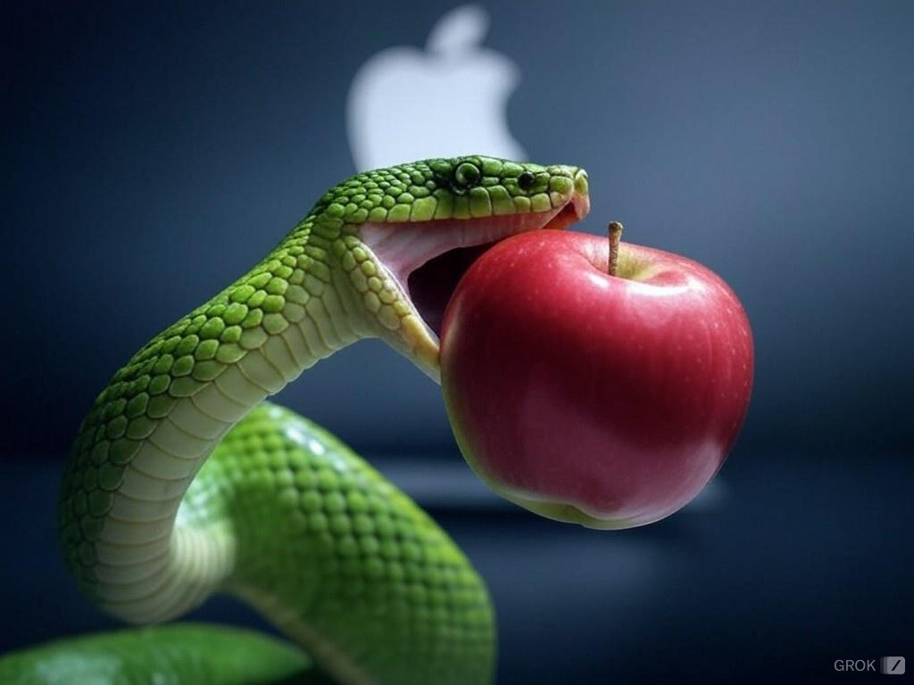

<!--
_backgroundColor: black
_color: white
-->

<!-- class: invert -->

# Biting the Apple

## Unlocking macOS with Python

---

<!--
paginate: true
footer: "Biting the Apple: Unlocking macOS with Python"
-->

# About Me

- Hobbyist programmer
- First code in Tandy BASIC on a TRS-80 Model III
- Reformed Perl hacker
- Pythonista since 2018
- [github.com/RhetTbull](https://github.com/RhetTbull)

---

# Installing Python on macOS

- brew (link to article)
- conda
- python.org
- uv

---

# Automating Mac Apps

- examples of AppleScript with Notes, Photos

---

# Isn't This Talk Supposed To Be About Python?

- py-applescript
- macnotesapp
- photoscript

---

# Examples with code snippets

---

# Accessing Native APIs

- PyObjC
- Rubicon

---

# PyObjc Overview

---

# PyObjc Examples

- Speech, vision, camera, convert heic to jpeg
- use ChatGPT Objc -> Python

---

# Add a GUI

- Rumps
- others

---

# Creating a Standalone App

- PyInstaller
- Py2App
- PyApp
- Briefcase

---

# Permissions & Entitlements

- disclaim.py
- Locationator example

---

# Questions?

- Link to slides
